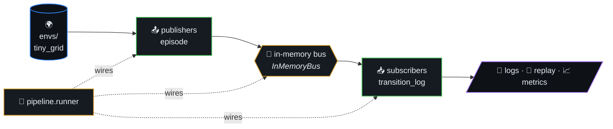
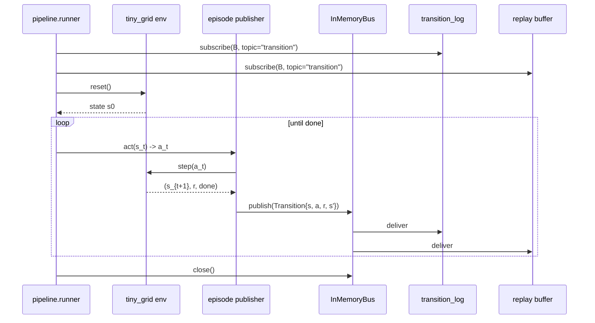
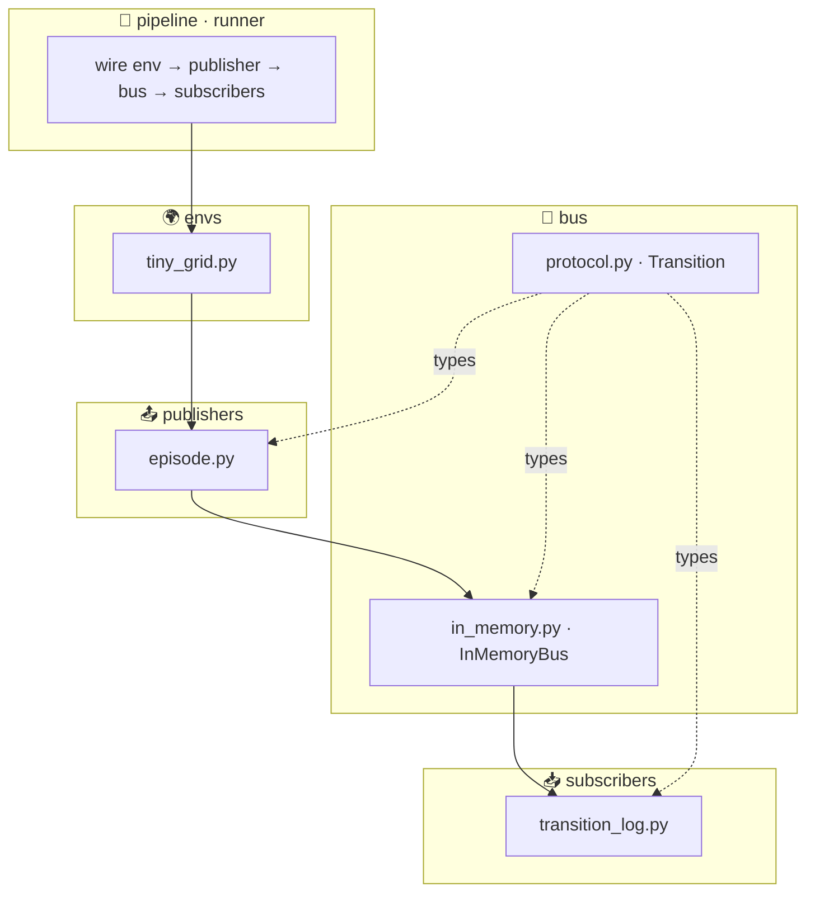

# reinforcement-learning-pipeline

> **Publisher → bus → subscriber** layout for RL rollouts: each
> environment transition is a message you can log, buffer for replay, or
> fan out to trainers — same structural idea as a pub/sub data pipeline,
> in-process for tests and local runs.



## Table of contents

- [Layout](#layout)
- [Architecture at a glance](#architecture-at-a-glance)
- [Rollout sequence](#rollout-sequence)
- [Quick start](#quick-start)
- [License](#license)

## Rollout sequence



## Layout

- `src/rl_pipeline/bus/` — message bus
- `src/rl_pipeline/envs/` — tiny environments
- `src/rl_pipeline/publishers/` — episode / rollout publishers
- `src/rl_pipeline/subscribers/` — loggers, replay writers, metrics
- `src/rl_pipeline/pipeline/` — orchestration
- `datasets/` — optional offline-RL manifests

### Architecture at a glance



## Quick start

```bash
cd reinforcement-learning-pipeline
python3 -m venv .venv && source .venv/bin/activate
pip install -e ".[dev]"
pytest
```

## License

MIT
