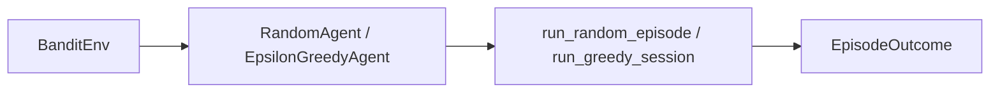

# reinforcement-learning-pipeline

Toy **multi-armed bandit** environment, **random** and **ε-greedy** agents, and the **`rlpipe` CLI**. Layout matches [`pub-sub-pipeline`](https://github.com/ml-lubich/pub-sub-pipeline): library + binary + `examples/` + integration tests + optional **llvm-cov** / **nextest**.

## Architecture



| Piece | Role |
|--------|------|
| **`BanditEnv`** | Stationary rewards: best arm vs others |
| **`RandomAgent`** | Uniform exploration baseline |
| **`EpsilonGreedyAgent`** | Incremental value estimates + ε noise |
| **`rlpipe`** | Binary: `demo`, `random`, `greedy` |

## Requirements

- **Rust 1.85+** (edition 2024; see `rust-version` in `Cargo.toml`).
- **Coverage** (optional): `cargo install cargo-llvm-cov --locked`
- **Nextest** (optional): `cargo install cargo-nextest --locked`

## Quick start

```bash
cargo test
cargo run --bin rlpipe -- --help
cargo run --bin rlpipe -- demo
cargo run --bin rlpipe -- random --arms 5 --best 2 --pulls 100 --seed 1
cargo run --bin rlpipe -- greedy --arms 5 --best 2 --pulls 100 --epsilon 0.1 --seed 1
cargo run --example demo
```

## Testing

| Workflow | Command |
|----------|---------|
| Default | `cargo test` |
| Nextest | `cargo nextest run` |
| Coverage | `cargo cov` (alias in `.cargo/config.toml`, ≥ 80% lines) |

CLI integration tests use **`assert_cmd`** (`tests/cli_e2e.rs`).

## Verify locally

```bash
cargo fmt --check
cargo test
cargo nextest run   # optional
cargo cov           # optional
cargo clippy --all-targets --locked -- -D warnings
```

## License

MIT — see `Cargo.toml`.
